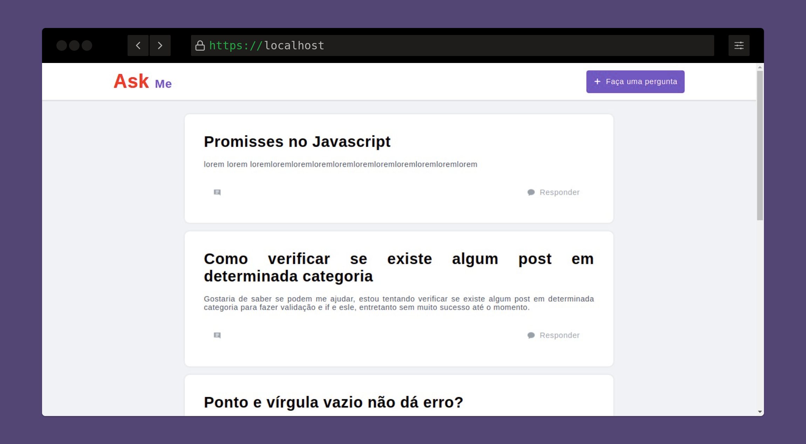
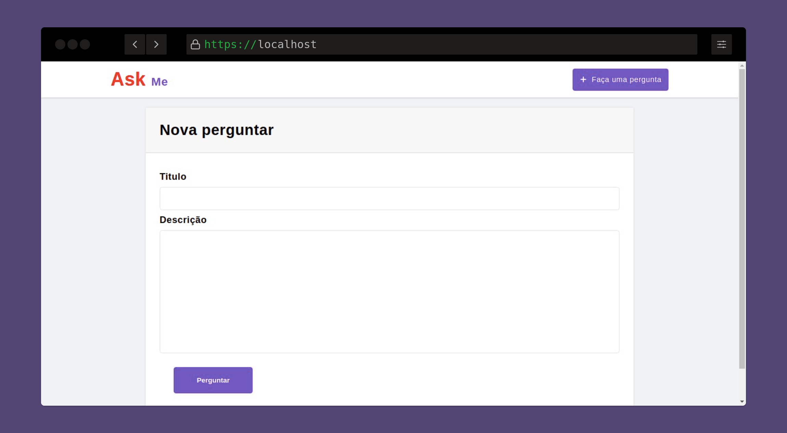
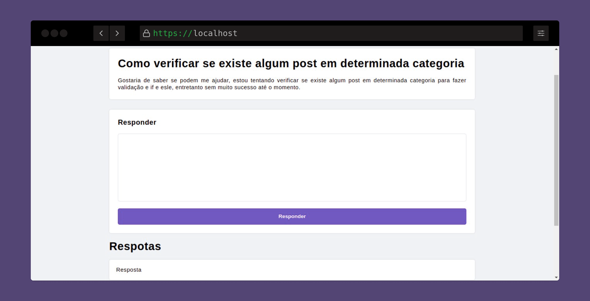

<h1 align="center">🤓Ask Me</h1>

<h1 id="sobre">Sobre</h1>
<p align="center" >Plataforma de perguntas e resposta no estilo Yahoo respostas, onde usuários podem fazer perguntas e responder perguntas anonimamente</p>
<div align="center">


</div>
<p align="center">
 <a href="#sobre">Sobre</a> •
 <a href="#layout">Layout</a> • 
 <a href="#instalacao">Instalação</a> • 
 <a href="#tecnologias">Tecnologias</a> • 
 <a href="#licenca">Licença</a> • 
 <a href="#autor">Autor</a>
</p>

<h1 id="layout">Layout</h1>
<div align="center">



</div>
<br>
<h1 id="instalacao">Instalação</h1>

```bash

# Clone este repositório
$ git clone https://github.com/Philipesissala/Ask-Me.git

# Acesse a pasta do projeto no terminal/cmd
$ cd Ask-me

# Instale as dependências
$ npm install

# Execute o arquivo perguntasBD.sql em sua SGBD

# Execute a aplicação em modo de desenvolvimento
$ npm start

# O servidor inciará na porta:3333 - acesse http://localhost:3333
```

<br>
<h1 id="tecnologias">💻 Tecnologias</h1>

- [HTML5](https://www.w3schools.com/html/default.asp)
- [CSS3](https://www.w3schools.com/css/default.asp)
- [Nunjucks](https://mozilla.github.io/nunjucks/)
- [Node.js](https://nodejs.org/en/)
- [Mysql](https://www.mysql.com/)

<h1>Licença</h1>
<p>Este projeto está licenciado sob a Licença MIT - veja o arquivo <a href="https://github.com/steniowagner/mindCast/blob/master/LICENSE">LICENSE.md</a> para mais detalhes.</p>
<p align="center">Feito com 💓 por Filipe Sissala</p>